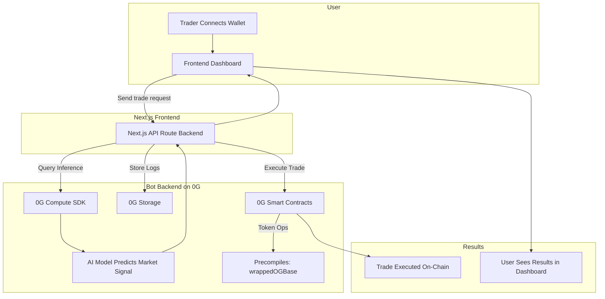

# 🤖 TradeGenius – AI-Powered Decentralized Trading Bot

**Tagline:**
“AI-driven, trustless, and transparent trading bot powered by 0G’s decentralized compute, storage, and smart contracts.”

---

## ❌ Problem Statement

Most trading bots today suffer from three big flaws:

* **Centralization & Trust Issues:** Bots typically run on private servers or centralized APIs (AWS, Binance APIs, OpenAI), making them opaque and prone to downtime or censorship.
* **Lack of Transparency:** Traders can’t verify how decisions are made — is the AI biased, manipulated, or even trading on their behalf?
* **Custody Risks:** Many bots require users to deposit funds into centralized platforms, leading to rug pulls and hacks.

This creates a **trust gap** between traders and the bots they rely on, making adoption limited despite huge demand.

---

## 💡 Proposed Solution / What We’re Building

We’re building **TradeGenius**, an **AI-powered, decentralized trading assistant** that lives entirely on the **0G ecosystem**.

Unlike centralized bots, TradeGenius leverages:

* **0G Compute Network + Inference SDK** → AI price predictions, sentiment analysis, and trade signals are processed on decentralized compute nodes.
* **0G Storage** → Training data and trading logs are stored in a verifiable, tamper-proof way.
* **Smart Contracts on 0G** → Trades are executed transparently and securely.
* **WrappedOGBase Precompiles** → Simplifies token management and execution without centralized intermediaries.

**In short:** It’s a **trustless AI trading bot** where users keep custody of their funds, strategies are auditable, and AI runs on decentralized infrastructure.

---

## 🔑 Key Features

### ✅ MVP (Wave 1–2)

* **Wallet-based access** → Users connect wallet, no signups or custody risk.
* **AI-powered trade signals** → Predictions generated on 0G Compute via Inference SDK.
* **Smart contract trade execution** → Transparent and automated.
* **Tamper-proof logs** → Stored in 0G Storage for accountability.

### 🚀 Future Waves

* **Multiple AI strategies** → Risk-averse, balanced, aggressive models.
* **Governance DAO** → Community votes on AI model upgrades.
* **Copy-trading marketplace** → Users can share and monetize their AI agents.
* **NFT-based performance badges** → Reward traders with provable success rates.

---

## 🛠️ Tech Stack

* **Frontend:** Next.js + TailwindCSS (trading dashboard, wallet integration)
* **Smart Contracts:** Solidity + Hardhat (trade execution, fund management)
* **Blockchain:** 0G chain (deployment + execution)
* **Compute:** 0G Compute Network + Inference SDK (AI models for trading)
* **Storage:** 0G Storage SDK (training datasets + logs)
* **Precompiles:** WrappedOGBase (token interactions)
* **AI Models:** LSTM / Transformer models for market trend prediction, with room for integration of sentiment analysis models.

---

## 🏗️ Architecture / Workflow

---

## 👨‍💻 How It Works (Step-by-Step User Flow)

1. User connects wallet to TradeGenius dashboard.
2. User selects AI strategy (e.g., “Risk Averse” bot).
3. Market data is fetched & sent to **0G Compute Network**.
4. AI model (deployed via **Inference SDK**) generates trade signals.
5. Signals are logged on **0G Storage** for auditability.
6. Smart contract executes trade (buy/sell/hold) using **wrappedOGBase precompiles**.
7. User sees transparent results in the dashboard.

---

## 🎯 Use Cases

* **Retail Traders** → Access transparent, non-custodial AI bots.
* **Crypto Communities** → DAO-run hedge funds powered by AI.
* **DeFi Protocols** → Can integrate TradeGenius as a service for users.
* **Hackathon & Research** → Showcase decentralized AI trading on 0G infra.

---

## 🌍 Impact & Differentiation

* **Decentralized AI** → No AWS, no OpenAI APIs. Runs fully on **0G Compute + Storage**.
* **Transparency** → Inference results + trade logs stored publicly and verifiable.
* **Trustless Execution** → Smart contracts + precompiles handle funds, not centralized bots.
* **User-first** → Traders retain custody of their assets at all times.

**Why it matters for 0G Hackathon:**
This project **pushes AI beyond chatbots** into **DeFi trading**, proving that **0G Compute & Storage** can power real-world, high-stakes applications where **trust, transparency, and decentralization** are critical.

---
